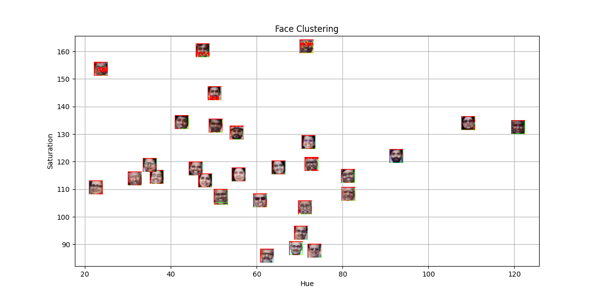
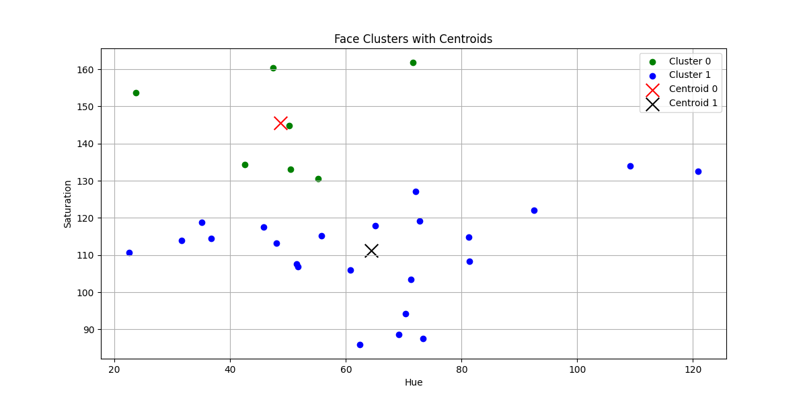
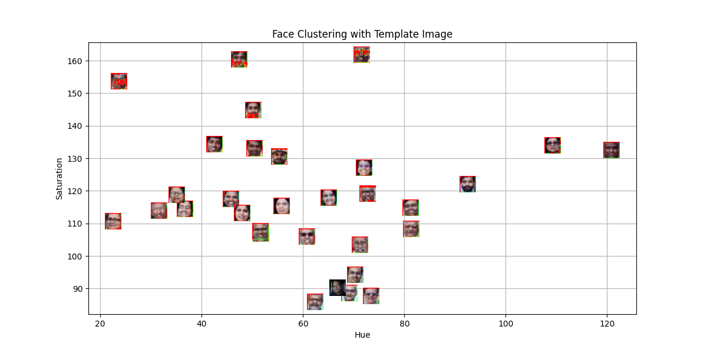
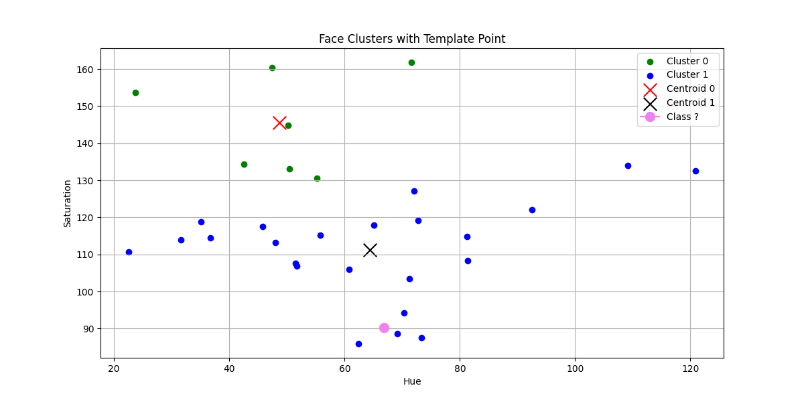

# distance_classification

A.1 Distance-based classification algorithms like KNN and clustering methods rely on different distance metrics to measure similarity between data points:

Euclidean Distance: Measures the straight-line distance between two points.
Manhattan Distance: Computes distance along axes, useful in grid-like structures.
Minkowski Distance: A generalized form of Euclidean and Manhattan distances.
Cosine Similarity: Measures the angle between vectors, commonly used in text classification.
Mahalanobis Distance: Accounts for correlations in data, useful in anomaly detection.
Hamming Distance: Measures the difference in categorical or binary data, applied in text and error detection.

A.2 Distance-based classification is widely used across various domains:

Medical Diagnosis: Predicting diseases using patient data.
Recommendation Systems: Movie and product recommendations using user preferences.
Fraud Detection: Identifying anomalies in financial transactions.
Text Analysis: Spam filtering and document similarity detection.
Image Recognition: Face detection and image retrieval.
Customer Segmentation: Grouping customers based on purchasing behavior.

A.3 Each distance metric has its strengths:

Euclidean: Effective for continuous numerical data but sensitive to scale variations.
Manhattan: Suitable for high-dimensional data with independent features.
Minkowski: Adaptable using different values of p.
Cosine Similarity: Ideal for high-dimensional sparse data, such as text.
Mahalanobis: Useful when features are correlated.
Hamming: Best for categorical or binary attributes.

A.4 Cross-validation helps improve model generalization by splitting data into multiple training and validation sets. It prevents overfitting, aids model selection, and balances the bias-variance tradeoff. Common techniques include k-fold cross-validation, stratified k-fold, and leave-one-out (LOO) validation

A.5 The value of k in KNN directly affects bias and variance:

Low k (e.g., 1-3) → Low bias, high variance → Overfitting.
Moderate k (e.g., 5-10) → Balanced tradeoff → Good .
High k (e.g., 50+) → High bias, low variance → Underfitting.
